# Комплексный SEO-аудит и конкурентное исследование pinskdrev.ru

**«Пинскдрев»**, белорусская мебельная фабрика: мягкая и корпусная мебель, кухни, матрасы. Сайт pinskdrev.ru работает как
интернет-магазин и витрина сети из 328 фирменных магазинов в России.
**Дата:** 16.09.2026. **Регион:** вся Россия, приоритет Москва. **Целевые системы:** Яндекс и Google.

Аудит подготовлен на основе восьми источников, все данные получены 16.09.2026: собственный обход сайта по HTTP
(2 190 адресов из карт сайта), проверка страниц в реальном браузере (Playwright), Firecrawl, PageSpeed Insights API,
Keys.so (базы Москва, Google Москва и семь региональных баз, история 18 месяцев), Arsenkin (ИКС, живая выдача Яндекса и
Google по 25 запросам, индексация, ответы Алисы), Яндекс Wordstat, WordKeeper. 17.09.2026 клиент открыл доступ к
Яндекс.Метрике (основной счётчик и семь региональных), данные за 24 месяца добавлены в раздел 2.4. Доступа к
Яндекс.Вебмастеру и Google Search Console пока нет, поэтому показы, клики по запросам и реальные ошибки индексации в аудит
не вошли. Рабочие файлы:
[база нашего сайта](audits/2026-09-16-baza-nash-sayt.md), [конкуренты](audits/2026-09-16-konkurenty.md),
[семантика](audits/2026-09-16-semantika.md).

---

## Резюме

Сайт большой, давно работающий и авторитетный: домену 21 год, ИКС 2 460, в Москве 10 840 запросов в ТОП-50 и 2 934 в ТОП-10,
в Google 28 545 и 9 085 соответственно. Каталог полноценный: 2 869 карточек с ценами, наличием, рассрочкой и видео, 1 083
категории и фильтровые страницы, блог на 327 статей. По авторитету сайт сильнее любого магазина белорусской мебели в 2–20 раз.

При этом рост остановился, и вот почему:

- **Видимость в Москве падает.** По Keys.so видимость сайта снизилась с 1 152 в апреле 2025 до 534 в сентябре 2026, то есть
  на 54 процента. Запросов на первом месте стало 813 вместо 1 093. Одновременно число запросов в ТОП-50 выросло с 5 767 до
  10 840, а число страниц с позициями с 906 до 1 632. Сайт растёт вширь, но теряет верх выдачи.
- **Метрика подтверждает: органика из Яндекса упала вдвое.** Визиты из Яндекса снизились с 44 250 в январе 2025 до 20 018 в
  августе 2026, из Google держатся на 31–32 тысячах. Покупок из поиска стало 14 в месяц вместо 32, выручка из органики
  1,5 млн рублей в месяц вместо 3,1 млн. Летом 2026 просадку закрыли рекламой: 112 707 визитов из Директа за 90 дней против
  1 063 годом ранее.
- **По общим категорийным запросам сайта нет в ТОП-10 Яндекса.** Живая выдача 16.09 по 25 денежным запросам: Яндекс 5 из 25,
  Google 10 из 25. Все пять попаданий в Яндексе это «белорусская мебель» и бренд. «Купить диван» (31 513 точных показов в
  месяц по Москве) стоит на 30-м месте, «спальня» на 24-м, «кожаный диван» на 11-м. 5 506 небрендовых запросов висят на
  21–50 позициях.
- **Брендовый спрос делится с дилерами.** Сайты mebelpinskdreva.ru (1 221 брендовых запросов в ТОП-10) и pinskdrevmebel.ru
  (584) стоят на 2–3 местах по «пинскдрев», «пинскдрев каталог», «пинскдрев официальный сайт» и называют себя «официальным
  сайтом». Ещё один дилер, пинскдрев.рф, ведёт 1 533 объявления в Директе.
- **Техническая база изношена.** www-зеркало отдаёт ошибку 500. Карта сайта состоит из 73 файлов, 67 из которых это вложенные
  индексы на региональные поддомены (протоколом не допускается), в картах 91 битый адрес из 2 190 проверенных, 213 адресов
  одновременно стоят в карте и закрыты в robots. 214 страниц без H1, 431 без description, 1 220 title длиннее 70 символов.
  JSON-LD нет ни на главной, ни в карточках. Мобильная скорость главной 33–45 из 100.
- **67 региональных поддоменов-клонов** по 4,5 тысячи адресов каждый, около 300 тысяч дублирующих страниц. В своих регионах
  они обгоняют основной домен, но абсолютные цифры малы: piter 4 186 запросов в ТОП-50, остальные 300–700.

Главный вывод: сайту не нужен редизайн или новый каталог. Нужно вернуть верх выдачи там, где спрос уже есть, и это три
направления работы: вернуть контроль над брендом, вывести категории и фильтровые страницы из зоны 11–50 в ТОП-10 за счёт
структуры и техники, и упорядочить региональную схему.

### Приоритеты

1. **P0.** Починить www-зеркало (500 вместо 301), карту сайта (убрать 67 вложенных индексов и 91 битый адрес), снять конфликт
   robots и sitemap по 213 адресам коллекций.
2. **P0.** Вернуть бренд: разметка Organization на главной, единая политика «официальный сайт» с дилерами, брендовые сниппеты,
   Яндекс.Бизнес и отзывы. Это 40 626 показов в месяц по России только по слову «пинскдрев».
3. **P1.** Массовые мета-теги: H1 на 214 страниц, description на 431, укоротить title карточек (медиана 103 символа) и
   категорий, убрать 30 групп дублей title и 28 групп дублей H1 у фильтров.
4. **P1.** Структура под спрос: полноценные разделы «кресла-кровати», «тахты», «реклайнеры», «стенки в гостиную», «угловые
   диваны», «белорусская мебель из массива», «белорусские кровати и столы» с текстами и перелинковкой. Ядро собрано:
   1 719 приоритетных небрендовых фраз на 181 491 точных показов в месяц по Москве.
5. **P1.** Разметка Product с рейтингом и отзывами, Open Graph, alt у 20 тысяч картинок. Отзывов в карточках сейчас нет вообще.
6. **P2.** Скорость: 8,5 МБ и 131 запрос на главной, 1,4 МБ неиспользуемого JS, LCP 19–37 секунд в лаборатории.
7. **P2.** Региональная схема: оставить 7 сильных поддоменов, остальные 60 свести в основной домен, связать поддомены с
   основным доменом ссылками, закрепить регионы в Вебмастере.
8. **P2.** Аналитика: 91 процент поисковых визитов попадает в Метрику с хвостом `?utm_referrer=`, который дописывает анти-бот
   скрипт, цель «Заказать звонок» перестала считаться (15 674 достижения за лето 2025, 6 за лето 2026), 8 тысяч визитов из
   Китая с отказом 2 процента. Без чистых данных эффект работ не измерить.

---

# Часть I. Проект и текущее состояние

## 1. О проекте

«Пинскдрев» производит мягкую и корпусную мебель, кухни и матрасы в Беларуси и продаёт в России через сеть из 328 фирменных
магазинов и сайт. На сайте указан московский телефон 8 (499) 938-86-36, действует рассрочка и сплит, видеоконсультации,
доставка и сборка. Домен pinskdrev.ru зарегистрирован 29.09.2005, оплачен до 29.09.2027.

**Стек.** Самописная платформа (по признакам Yii: cookie PHPSESSID и `_csrf`, страница ошибки «Not Found (#404)»), HTTP/2,
gzip, HSTS. Сайт закрыт анти-бот защитой с JS-проверкой: любой запрос без выполнения JavaScript получает заглушку с тегом
`noindex, noarchive`. Поисковые роботы и PageSpeed защиту проходят (Keys.so видит 1 632 страницы в выдаче, PSI отдаёт оценку
SEO 85 из 100), но парсеры, валидаторы разметки и краулеры ИИ-сервисов без JS видят пустую страницу с noindex.

**Структура каталога** (карты сайта основного домена, 4 756 адресов): 93 страницы меню и информации, 1 083 категории и
фильтровые страницы вида `/catalog/myagkaya-mebel/divanyi/f/material--naturalnaya_kozha/`, 2 869 карточек товара, 210 коллекций,
327 статей блога, 177 новостей. Категория «Диваны» содержит 444 модели.

**Региональная схема.** У основного домена 67 региональных поддоменов (piter, krasnodar, kazan, novosibirsk, ekaterinburg,
voronezh, saratov, tula, ryazan, ufa, samara, omsk, perm и другие), все перечислены в sitemap.xml основного домена. Каждый
поддомен это полный клон каталога (piter: 765 категорий, 2 869 карточек) с городом в title, H1 и description. Клиент в
переписке называет семь региональных сайтов, по факту их 67. Московский поддомен moscow.pinskdrev.ru в 2026 году склеен с
основным доменом: все его адреса отдают 301 на тот же путь pinskdrev.ru, в выдаче Москвы у него осталось 29 запросов.

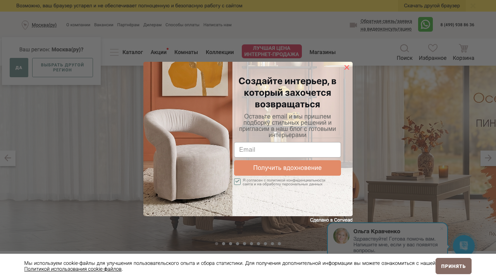

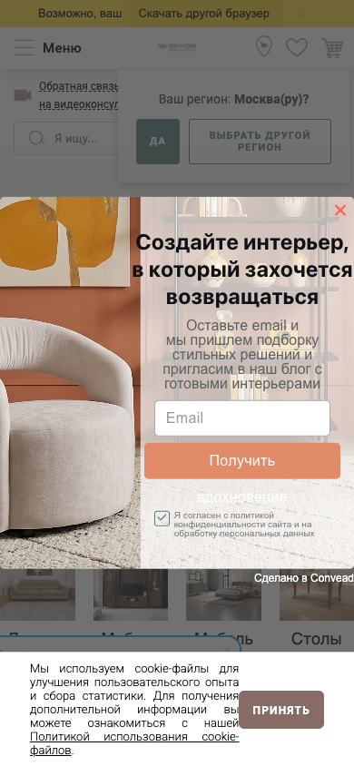

## 2. Видимость и динамика

### 2.1 Яндекс, база Москва (Keys.so, 16.09.2026)

- Запросов в ТОП-1: 813, ТОП-3: 1 512, ТОП-10: 2 934, ТОП-50: 10 840. Страниц с позициями 1 632. DR 33. Упоминаний в
  AI-ответах Яндекса 548.
- Из 10 840 запросов брендовых 1 079 (864 из них в ТОП-3), небрендовых 9 761. Небрендовые распределены так: ТОП-3 632,
  4–10 1 269, 11–20 2 354, **21–50 5 506**. Точная частотность небрендовых запросов 271 032 показа в месяц, брендовых 31 728.
- Самые ёмкие небрендовые запросы и их позиции: «купить диван» 30 (31 513), «спальня» 24 (7 542), «мебель белорусская мебель»
  4 (6 797), «белорусская мебель» 10 (4 864), «кресло кровать раскладное» 35 (2 702), «мебельная фабрика» 38 (2 420),
  «кожаный диван» 11 (2 099), «диван тахта» 18 (2 009), «кресло мягкое» 24 (1 333), «кровать с мягким изголовьем» 15 (1 252).
- Распределение по разделам: мягкая мебель 2 918 запросов, корпусная 2 640, главная 901, кухни 618. Фильтровые страницы `/f/`
  держат 3 012 запросов на 70 244 точных показов, это работающий инструмент. Блог держит 1 656 запросов, но почти все
  информационные («что делать если скрипит диван», «фазы сна», «как шоколад влияет на сон»).
- Потеряно за период наблюдения 2 257 запросов и 2 165 страниц. Самые ёмкие потери: «кухонный гарнитур» (29 325, была 16-я
  позиция), «кресло реклайнер» (5 700, была 23-я), «диван с оттоманкой» (1 716, 12-я), «тахта купить» (861), «обеденная группа»
  (621, 14-я). Потерянные страницы это в основном карточки снятых с продажи моделей.

**Динамика за 18 месяцев.** Видимость сайта падает, число запросов в ТОП-10 и ТОП-50 растёт. Это означает, что новые
страницы и запросы прибавляются на дальних позициях, а самые трафиковые запросы сползают вниз. Пик по первым местам был в
октябре–ноябре 2025 (1 093), с тех пор минус 26 процентов.

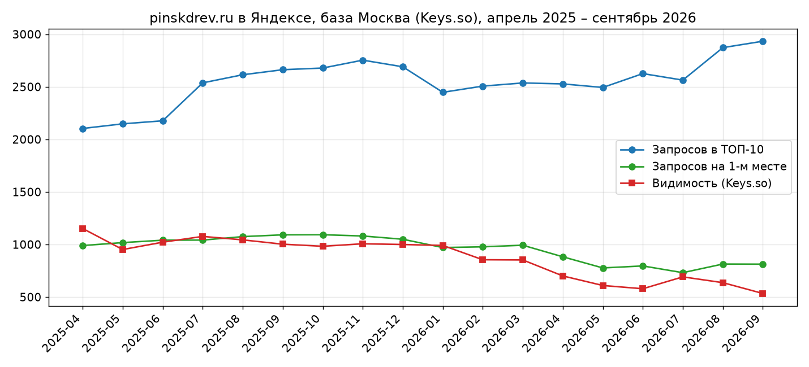

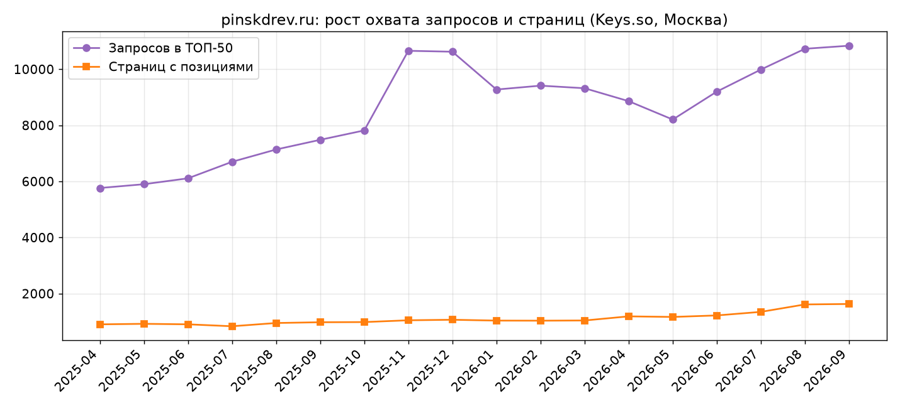

В июне–сентябре 2026 на сайте резко вырос Директ: 1 469 объявлений и 12 388 рекламных ключей против 4 объявлений в апреле
2025. Похоже, падение органики компенсируют рекламой.

### 2.2 Google, база Москва (Keys.so gru)

DR 35, ТОП-1 1 464, ТОП-10 9 085, ТОП-50 28 545, страниц 3 505. Небрендовых запросов в ТОП-10 2 697 на 320 451 точных показов.
В Google сайт заметно сильнее, чем в Яндексе: по 25 живым запросам он в ТОП-10 в 10 случаях против 5. Часть видимости в Google
даёт непрофильный раздел спичек (116 запросов, «спички купить», «спичка») и блог («честерфилд», «фазы сна», «кухонный остров»).
Конкуренты по пересечению запросов в Google: pinskdrevmebel.ru, pinskdrev.by (сайт фабрики в Беларуси, 1 070 общих запросов),
belmebelshop.ru, pandrev.ru, mebelpinskdreva.ru.

### 2.3 Региональные поддомены (Keys.so, региональные базы)

| База | Поддомен: ТОП-10 / ТОП-50 / страниц | pinskdrev.ru в той же базе | Кто сильнее |
|---|:---:|:---:|:---:|
| Санкт-Петербург | piter: 1 025 / 4 186 / 666 | 313 / 1 297 / 273 | поддомен |
| Воронеж | voronezh: 260 / 961 / 154 | 41 / 228 / 79 | поддомен |
| Новосибирск | novosibirsk: 188 / 712 / 151 | 34 / 188 / 70 | поддомен |
| Краснодар | krasnodar: 155 / 679 / 161 | 44 / 189 / 73 | поддомен |
| Екатеринбург | ekaterinburg: 124 / 497 / 122 | 33 / 153 / 56 | поддомен |
| Казань | kazan: 148 / 430 / 127 | 64 / 204 / 94 | поддомен по числу запросов, по видимости паритет |
| Саратов | saratov: 76 / 398 / 90 | 64 / 196 / 79 | поддомен по числу запросов, по видимости паритет |
| Москва | moscow: 3 / 29 / 24 (после склейки) | 2 934 / 10 840 / 1 632 | основной |

Поддомены в своих регионах собирают в 2–4 раза больше запросов, чем основной домен, но масштаб несопоставим с Москвой:
Петербург даёт 4 186 запросов в ТОП-50, Воронеж 961, остальные регионы 400–700. ИКС у всех поддоменов общий с основным
доменом (2 460).

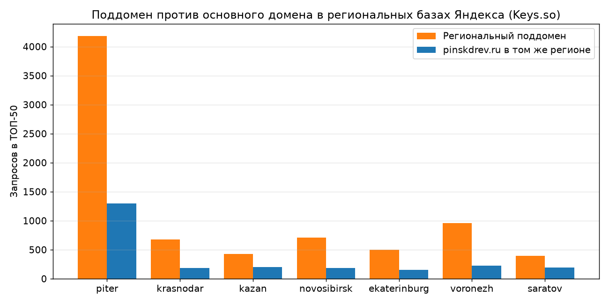

### 2.4 Яндекс.Метрика: трафик, заказы, регионы (доступ получен 17.09.2026)

Счётчик основного домена 8072398, данные с сентября 2024 по 16 сентября 2026. Региональные счётчики: piter 26438841,
krasnodar 26039190, kazan 26438808, novosibirsk 26438985, ekaterinburg 42170309, voronezh 27005304, saratov 26438910.
Выгрузки в `data/yandex/metrika/`.

**Поисковый трафик основного домена.** Из Яндекса: 44 250 визитов в январе 2025, 27 650 в апреле 2025 (первое резкое
снижение), 20 018 в августе 2026. Из Google: 32 785 в январе 2025, 36 181 на пике в ноябре 2025, 31 220 в августе 2026.
За последние 90 дней (18.06–16.09.2026) поиск дал 143 507 визитов против 158 750 за тот же период 2025 года: Яндекс 57 483
против 70 820 (минус 19 процентов), Google 85 038 против 87 089 (минус 2 процента). Google теперь даёт 59 процентов
поискового трафика, хотя в начале 2025 года Яндекс давал больше. Это совпадает с картиной Keys.so: проблема именно в Яндексе.

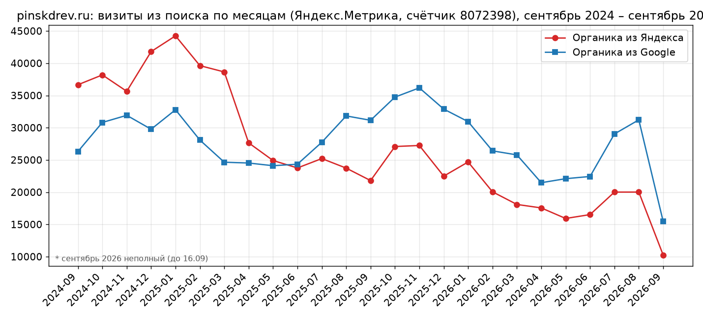

**Все источники за 90 дней.** Поиск 143 507 визитов (отказы 11 процентов), реклама 112 707 (отказы 23 процента, год назад
было 1 063 визита), переходы по ссылкам 90 839, прямые заходы 15 921, внутренние 8 723. Общая посещаемость выросла до
138 тысяч в июле и августе 2026 против 91–92 тысяч годом ранее, но целиком за счёт Директа.

**Заказы.** Электронная коммерция в Метрике включена. За 90 дней поиск принёс 51 покупку на 6,40 млн рублей, реклама 15 на
1,29 млн, прямые заходы 12 на 1,54 млн, ссылки 11 на 1,17 млн. Поиск остаётся главным каналом продаж с сайта, и именно он
проседает: в первом полугодии 2025 из органики приходило в среднем 32 покупки и 3,1 млн рублей в месяц, в январе–августе
2026 в среднем 14 покупок и 1,5 млн рублей. Цели за 90 дней из поиска: 5 213 добавлений в корзину, 330 кликов по телефону,
51 покупка.

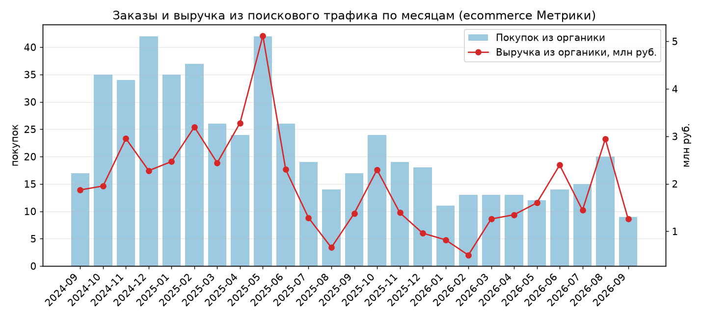

**Посадочные из поиска (90 дней, адреса без параметров).** Главная 34 343 визита (29 процентов от разобранных), корпусная
мебель 24 034, фильтровые страницы 16 611, мягкая мебель 13 171, карточки товаров 11 142, кухни всего 1 560. Отдельно 4 575
визитов на страницу «Партнёрам», это не покупатели. Три четверти поискового трафика приходит на главную и верхние категории,
то есть на брендовые и общие запросы, карточки и кухни почти не участвуют.

**Устройства и география.** Из поиска 70 процентов визитов со смартфонов, 29 с компьютеров. Из 113 762 визитов с
определённым городом на Москву приходится 42 351 (37 процентов), Санкт-Петербург 6 272. Отдельная аномалия: 8 038 визитов из
Китая (Гонконг) с отказом 2 процента и глубиной 1,9 страницы, 1 611 из Финляндии. Это ботовый трафик, который искажает
поведенческие метрики.

**Региональные поддомены (органика, август 2026).** piter 7 947 визитов, krasnodar 6 471, novosibirsk 1 811, kazan 1 792,
voronezh 1 576, ekaterinburg 1 275, saratov 559, вместе 21 431 против 51 238 у основного домена. Петербург упал вдвое:
15 816 в ноябре 2025, 7 947 в августе 2026. Новосибирск с 4 146 в сентябре 2025 до 1 811. Краснодар стабилен. Скачки общей
посещаемости поддоменов (Новосибирск 58 тысяч в ноябре–декабре 2025) это рекламные кампании, органика ровная.

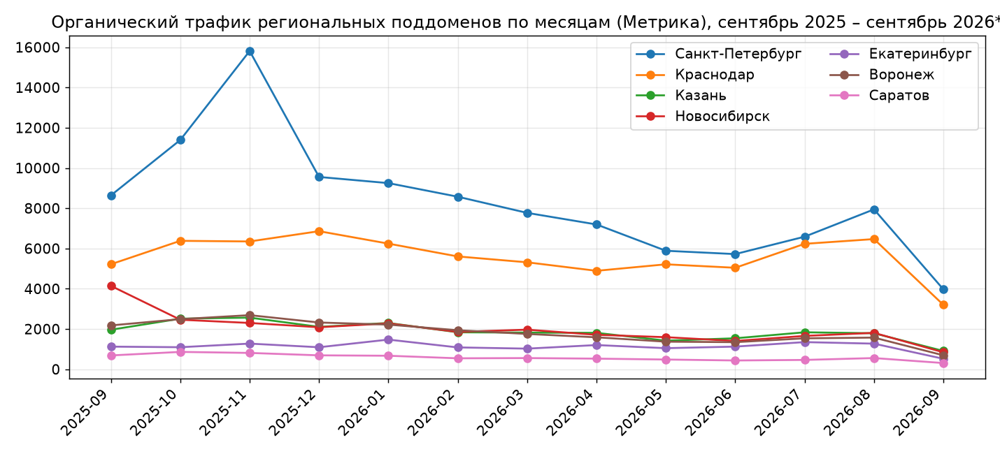

**Проблемы измерения, которые надо устранить до старта работ.**

- 91 процент поисковых визитов записан с адресами вида `/?utm_referrer=yandex.ru` и `/catalog/…/?utm_referrer=google.com`.
  Эти хвосты дописывает скрипт анти-бот защиты при переходе из поиска. В Метрике одна страница превращается в три адреса,
  а перезагрузка страницы создаёт второй просмотр, поэтому отказы на категориях показывают 0,1–3 процента вместо реальных.
- Цель «Заказать звонок» за лето 2025 дала 15 674 достижения из поиска, за лето 2026 только 6; «Связаться с менеджером» 47
  против 3. Либо формы изменились, либо цели сломаны. Проверить перед тем, как считать конверсию.
- Ботовый трафик из Китая и Финляндии стоит отфильтровать в настройках счётчика.

## 3. Спрос: семантика

Собрано ядро из трёх источников: запросы сайта из Keys.so (10 840), ядро по домену из Arsenkin (9 282) и парсинг левой колонки
Вордстата по 25 маскам (14 530). После объединения и чистки от чужих брендов, б/у, «своими руками» и туристических ассоциаций
Беларуси осталось **23 613 фраз**. Точная частотность по Москве подтверждена у 9 788 фраз (сумма 280 321 показ в месяц),
дополнительно 2 500 новых фраз проверены через WordKeeper в Москве и 1 000 самых ёмких по России. Приоритетный небрендовый
набор: **1 719 фраз, 181 491 точных показов в месяц по Москве**. Файлы в папке `semantika/`, разбор в
[audits/2026-09-16-semantika.md](audits/2026-09-16-semantika.md).

### Головной спрос (Wordstat, базовая частотность, показов в месяц)

| Запрос | Россия | Москва |
|---|:---:|:---:|
| диван | 5 176 616 | 714 129 |
| угловой диван | 320 489 | 45 140 |
| диван кровать | 351 100 | 60 302 |
| кресло кровать | 165 123 | 28 094 |
| тахта | 133 821 | 19 777 |
| спальня | 1 055 992 | 115 231 |
| стенка | 1 367 115 | 151 877 |
| прихожая | 853 628 | 111 851 |
| кухни на заказ | 77 390 | 10 832 |
| мягкая мебель | 176 646 | 18 618 |
| мебельная фабрика | 289 085 | 36 031 |
| мебель из массива | 16 973 | 3 176 |
| белорусская мебель | 31 741 | 5 215 |
| белорусские диваны | 5 793 | 901 |
| пинскдрев | 40 626 | 5 565 |

### Ёмкость направлений и что уже закрыто

Сумма точной частотности фраз ядра по Москве и число фраз, по которым сайт уже в ТОП-10:

| Направление | Фраз | Точных показов | В ТОП-10 сейчас |
|---|:---:|:---:|:---:|
| Диваны | 1 360 | 68 734 | 280 |
| Бренд | 913 | 30 494 | 838 |
| Белорусская мебель | 374 | 19 848 | 167 |
| Спальни | 482 | 15 084 | 133 |
| Диваны угловые | 605 | 11 522 | 91 |
| Кухни | 651 | 10 968 | 144 |
| Кровати | 356 | 9 924 | 45 |
| Кресла | 255 | 9 326 | 23 |
| Тахты и кушетки | 279 | 9 022 | 12 |
| Фабрика, производитель | 418 | 8 624 | 4 |
| Столы и стулья | 504 | 8 348 | 75 |
| Диваны кожаные | 190 | 7 659 | 55 |
| Кресла-кровати | 153 | 6 010 | 5 |
| Мебель из массива | 248 | 5 510 | 31 |
| Гостиные и стенки | 377 | 5 189 | 82 |

Бренд закрыт на 92 процента, остальные направления на 5–25 процентов. Кресла-кровати (6 010 показов, 5 фраз в ТОП-10), тахты
(9 022, 12 фраз) и реклайнеры это направления, где у сайта есть товар и фильтровые страницы, но нет позиций.

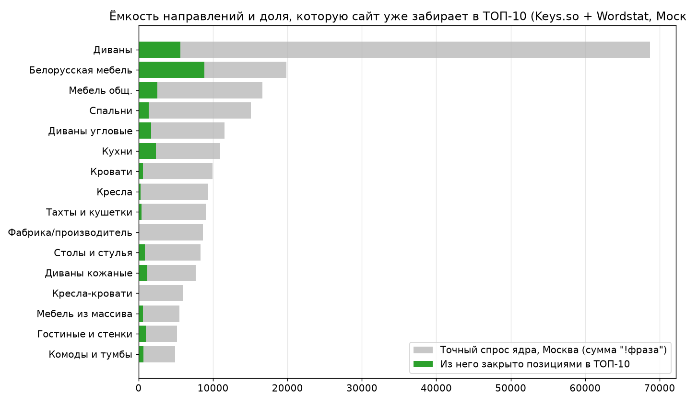

### Сезонность и тренд

Спрос на мебель растёт с августа до пика в ноябре–январе и проседает в апреле–мае. Год к году категория растёт быстрее бренда:
«купить диван» плюс 18 процентов (август 2026 к августу 2025), «белорусская мебель» плюс 36 процентов, «пинскдрев» плюс 14
процентов. Сентябрь–декабрь это лучшее время для запуска работ, к пику спроса должны быть готовы техника и посадочные.

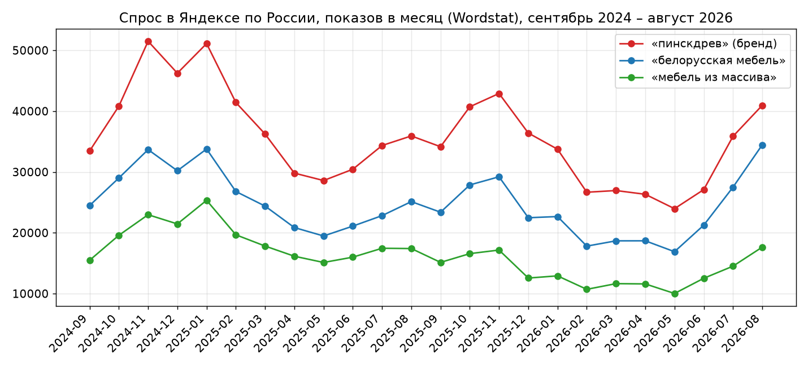

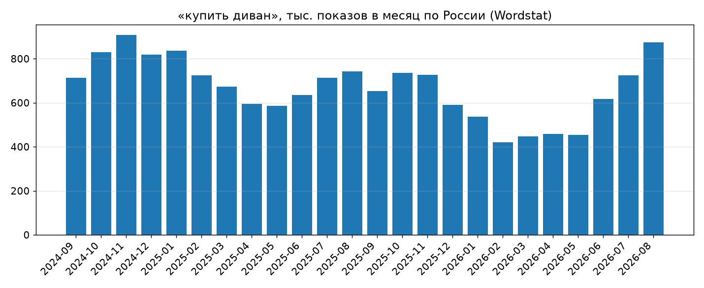

## 4. Технический аудит

Обход выполнен 16.09.2026 по 2 190 адресам из карт сайта (все страницы меню, все категории и фильтры, все коллекции, все
статьи и новости, случайные 300 карточек из 2 869). Итог: 2 098 страниц с кодом 200, 91 с кодом 404, 1 таймаут.

### 4.1 P0. Зеркало www отдаёт ошибку 500

`https://www.pinskdrev.ru/` и `http://www.pinskdrev.ru/` отвечают «500 An internal server error occurred», проверено curl и в
браузере. Любой переход по адресу с www (старые ссылки, ввод вручную, часть каталогов) заканчивается ошибкой сервера.
Должен быть 301 на `https://pinskdrev.ru/`. Остальные зеркала настроены: `http://` даёт 308 на https, адреса без слеша дают 301
на адрес со слешем, `/index.php` открывается как дубль главной, но с canonical на главную.

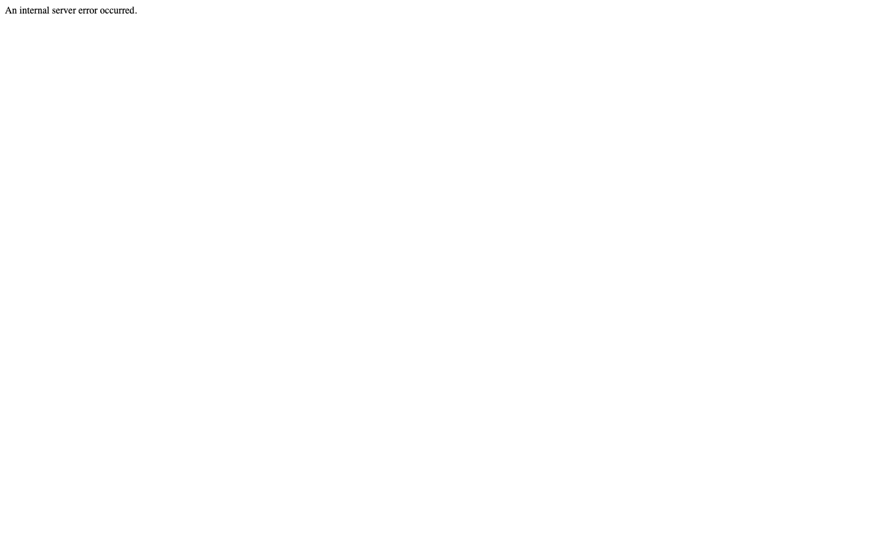

### 4.2 P0. Карта сайта: вложенные индексы и битые адреса

`sitemap.xml` основного домена это индекс из 73 файлов. Шесть из них свои (главное меню, категории, товары, блог, новости,
коллекции), а **67 это индексы региональных поддоменов** `sitemap_regions_*.xml`, каждый из которых снова индекс с шестью
картами на другом хосте (`https://tula.pinskdrev.ru/sitemaps/…`). Протокол sitemap не допускает ни вложенных индексов, ни
адресов на чужом хосте: поисковики эти 67 файлов игнорируют, а сам индекс выглядит для них ошибочным.

Битые адреса в картах (проверено обходом): 12 из 93 в карте меню (старые статьи, `/catalog/dlya-dachi/`), 18 из 1 083 в карте
категорий (фильтры раздела «для дачи», `metallicheskaya_ramka`), **44 из 210 коллекций** (21 процент), 17 из 300 проверенных
карточек (5,7 процента, оценочно около 160 на всю карту товаров). Дата lastmod у всех карт одна, 06.07.2026, то есть карта не
отражает реальные обновления.

### 4.3 P0. Конфликт robots.txt и карты сайта

В robots.txt закрыты `/collections`, `/roomtypes`, `/styles`, `/site/`, и при этом карта сайта содержит 210 адресов
`/collections/…` и по одному адресу `/roomtypes`, `/styles`, `/site/`. Сайт просит проиндексировать 213 адресов и сам же запрещает
их обход; проверка индексации подтверждает, что коллекции не в индексе ни в Яндексе, ни в Google. Коллекции (Алези, Тунис,
Валенсия, Барселона) это готовые посадочные под запросы вида «диван барселона 2» (63 точных показа, сайт на 3-м месте с
карточки), поэтому решение нужно принять: либо открыть и наполнить, либо убрать из карты.

Остальное в robots.txt в порядке: закрыты корзина, заказ, поиск, параметры и фильтры со словом filter, открыта пагинация
`?page=`. Замечание: в `Clean-param` висячий `&` в конце строки.

### 4.4 P1. Мета-теги: длина, дубли, пропуски

| Показатель | Значение |
|---|---|
| Title длиннее 70 символов | **1 220 из 2 098**, медиана 76. Все карточки: медиана 103 символа, шаблон «Модель + артикул купить в интернет-магазине Пинскдрев (Россия) - цены, фото, размеры» |
| Title короче 30 символов | 237 (коллекции: «Алези», «Тунис») |
| Два разных шаблона title в каталоге | 736 страниц «X в интернет-магазине производителя Пинскдрев - Россия» и 341 «X — купить от белорусского производителя «Пинскдрев»» |
| Дубли title | 30 групп, 99 страниц: фильтры «Комоды», «Комбинированные шкафы», «Полки», «Вешалки» повторяются в 6–9 разделах с одним title и H1 |
| Description отсутствует | **431 страница**: 222 статьи блога, 143 новости, 59 информационных, 7 категорий |
| Description короче 80 символов | 719; дубли 22 группы, 90 страниц («Комоды. Интернет-магазин Пинскдрев.ру в России») |
| Title совпадает с H1 дословно | 432 страницы |
| Open Graph, Twitter Card | нет ни на одной странице |
| hreflang | нет, при 67 региональных хостах |

Title карточек содержат заводской артикул («Тумба 2д «Лотос» БМ2.701.4.35(1074) купить…»), из-за чего обрезаются в выдаче до
артикула, а ключевое слово «купить» и цена не видны. Пагинация: страницы `?page=2` открыты для индексации, canonical ведёт на
первую страницу, rel next/prev нет, а в title стоит служебная метка региона: «Диваны: купить в Москва(ру) | Страница №2».
Та же метка «Москва(ру)» видна пользователю в окне выбора региона.

### 4.5 P1. Заголовки H1

**214 страниц без H1**: все 176 новостей, страницы «О компании», «История компании», «Документы», «Оптовикам», весь раздел
«Уход и эксплуатация» (37 страниц), одна категория. 6 статей блога с двумя H1. 28 групп дублей H1 (108 страниц). На страницах
`/contacts/` и `/shops/` после H1 идут 328 заголовков H4 «Фирменный магазин «Пинскдрев»» с пропуском уровней. На поддомене
piter страница спален содержит два H1 («Спальные гарнитуры» и «Мебель для спальни»).

### 4.6 P1. Структурированные данные и карточка товара

- Главная: разметки нет вообще, ни Organization, ни WebSite. Именно Organization с sameAs и логотипом даёт поисковику сигнал,
  какой из трёх «официальных сайтов» настоящий.
- Карточки: только microdata `Product` и `Offer` с ценой, наличием и хлебными крошками. JSON-LD нет, `itemprop="description"`
  пустой во всех 283 проверенных карточках, рейтинга и отзывов нет (AggregateRating 0, Review 0). У федеральных конкурентов
  в сниппете стоят звёзды и число отзывов, у нас только цена.
- Единственные страницы с JSON-LD это `/contacts/` и `/shops/`: по 328 блоков `Organization` (по одному на магазин). Для
  магазинов нужен тип `Store` или `LocalBusiness` с адресом, часами и телефоном, а не 328 организаций.
- Блог: microdata Article с датой публикации и автором есть, JSON-LD нет, у 222 из 327 статей нет description.

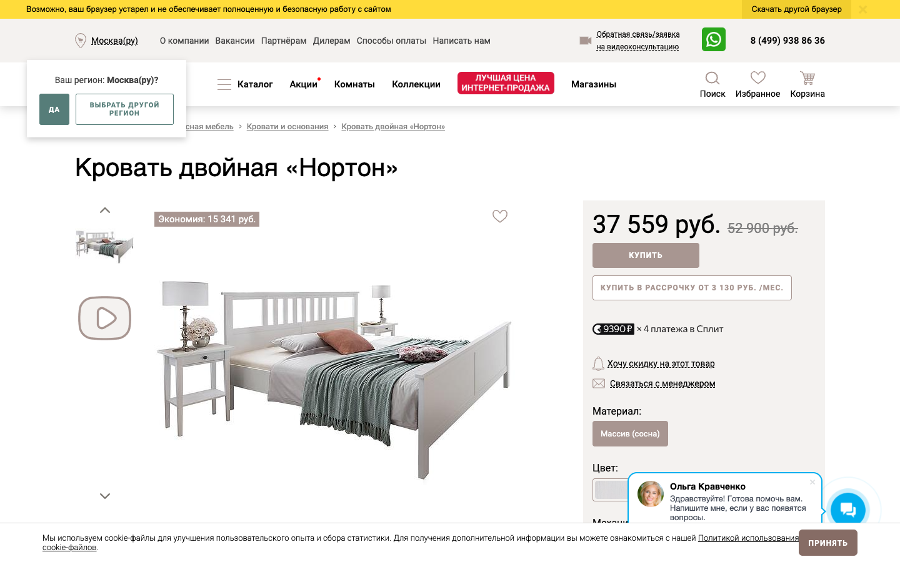

### 4.7 P2. Скорость

| Страница | Mobile | LCP (лаборатория) | Блокировка потока | CrUX, реальные пользователи | Desktop |
|---|:---:|:---:|:---:|:---:|:---:|
| Главная | 33–45 | 25,5–36,8 с | 680–2 590 мс | LCP 2,6 с, TTFB 1,5 с, средне | 37 |
| Категория «Диваны» | 61 | 1,9 с | 2 050 мс | медленно | 30, CLS 0,206 |
| Карточка «Нортон» | 34 | 18,6 с | 2 220 мс | средне | не замерялось |

Главная весит 8,5 МБ и делает 131 запрос. Неиспользуемого JavaScript 1,4 МБ (оценка экономии около 8 секунд), неиспользуемого
CSS 540 КБ, работа главного потока 10,4 секунды. Best Practices 54 из 100: на главной три баннера новостей грузятся по http
с хоста a.pinskdrev.ru (смешанный контент, браузер помечает страницу как небезопасную), сторонние cookies, ошибки в консоли. Время ответа HTML при обходе: медиана 3,1 секунды, 90-й процентиль 4,3 секунды.
Cache-Control выставлен непоследовательно: каталог и карточки кэшируются на час, главная на три дня, блог не кэшируется.

### 4.8 P2. Canonical, noindex, изображения

- Canonical стоит на всех 2 098 страницах, 2 087 указывают на себя. 11 ведут на другую страницу, среди них битый
  `https://pinskdrev.ru/Столы для дачи` (кириллица и пробелы в href) на фильтре «столы на дачу» и canonical с фильтра
  «модульные диваны» на несуществующий в карте `/catalog/modular/sofa/`.
- Noindex стоит на 7 фильтрах механизма «вперёд выкатной», одной категории и 7 статьях блога, при этом эти статьи остаются в
  карте сайта.
- Изображений 115 248, **без alt 19 956** (17 процентов), с пустым alt 16 472. В карточках без alt 28 процентов картинок, в
  новостях 35. Для мебели, где картинка и есть товар, это потеря трафика из поиска по картинкам.
- Внутренних ссылок на странице медиана 536 (меню, футер, региональный переключатель). Поддомен piter не ссылается на основной
  домен ни разу.

### 4.9 P2. Региональные поддомены как источник дублей

67 поддоменов по 4,5 тысячи адресов это около 300 тысяч страниц каталога с одинаковыми товарами. Что сделано правильно: у
поддоменов свои title, H1 и description с городом, canonical на себя, блог закрыт noindex. Что не сделано: текст категорий
совпадает с основным доменом на 59 процентов по словарю, нет hreflang и связи с основным доменом, все 67 индексов вложены в
карту основного домена, регионы поддоменов в Вебмастере проверить не можем. По данным Keys.so поддомены дают в своих регионах
в 3–5 раз больше запросов, чем основной домен, поэтому просто закрывать их нельзя, но 60 из 67 не дают заметных цифр.

### 4.10 P2. Поп-апы при входе

При первом заходе пользователь видит четыре слоя поверх контента: окно подтверждения региона, поп-ап сбора email (Convead),
cookie-плашку и чат-виджет; на мобильном экран закрыт полностью. Google считает такие перекрытия навязчивыми межстраничными
элементами, Яндекс учитывает поведение. Email-окно стоит показывать не раньше второй страницы или через 30 секунд, окно
региона делать компактной строкой.

### 4.11 Что в порядке

Коды ответа страниц чистые (кроме битых адресов в картах), 404 отдаёт корректный код, редиректы без цепочек, HTTPS и HSTS
настроены, favicon есть, canonical на всех страницах, атрибут lang и viewport на месте, категории содержат текст (медиана
1 667 слов вместе с меню, SEO-текст 60–90 слов над листингом), тонких страниц нет, у карточек есть цена, наличие, рассрочка,
видео и характеристики.

Коммерческие факторы, которые Яндекс оценивает у магазинов, в основном закрыты: на странице контактов есть ИНН, ОГРН и
юридический адрес ЗАО «Пинскдрев-Москва», есть страницы «Гарантии» (сроки по ГОСТ 16371 и 19917), «Доставка и оплата»,
«Сборка», «Оферта», «Преимущества официального представителя», список из 328 магазинов, рассрочка и сплит в карточках.
Замечания к этому блоку: у страниц «Гарантии» и «Покупателям» нет H1, «Покупателям» это пустой хаб без текста, а страница
«Доверяй, но проверяй» рассказывает о подделках мебели, но не о том, какие сайты являются официальными.

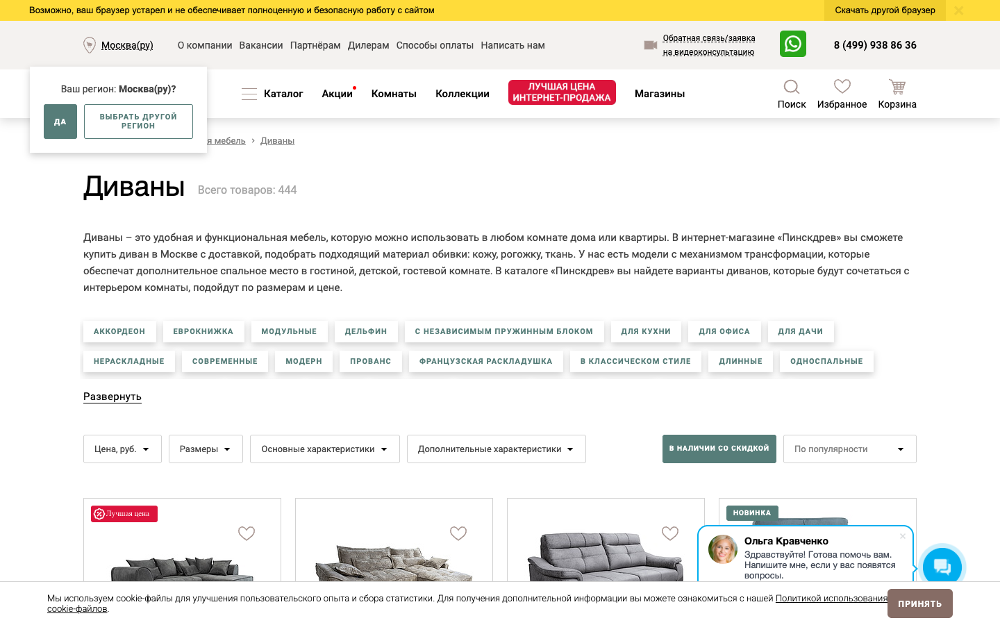

## 5. Индексация выборки (Arsenkin, 16.09.2026)

| Адрес | Яндекс | Google |
|---|:---:|:---:|
| Главная | есть | есть |
| Категория «Диваны» | есть | есть |
| Фильтр «Кожаные диваны» | есть | есть |
| Коллекция `/collections/alezi/` (закрыта в robots) | нет | нет |
| Пагинация `?page=2` | есть | нет |
| moscow.pinskdrev.ru, категория (301) | нет | нет |
| piter.pinskdrev.ru, категория | есть | есть |
| Статья блога | есть | есть |
| Карточка «Нортон» | есть | есть |
| www.pinskdrev.ru | нет | нет |

Основные типы страниц в индексе. Склейка Москвы отработала: адреса moscow из индекса ушли. Пагинация в Яндексе индексируется,
в Google нет, что подтверждает необходимость решить вопрос с ней осознанно.

---

# Часть II. Конкуренты

## 6. Обзор конкурентной выдачи

Конкуренты найдены через живую выдачу Яндекса и Google (Москва) по 25 запросам, затем разобраны через Keys.so. Полная таблица
позиций в [audits/2026-09-16-konkurenty.md](audits/2026-09-16-konkurenty.md).

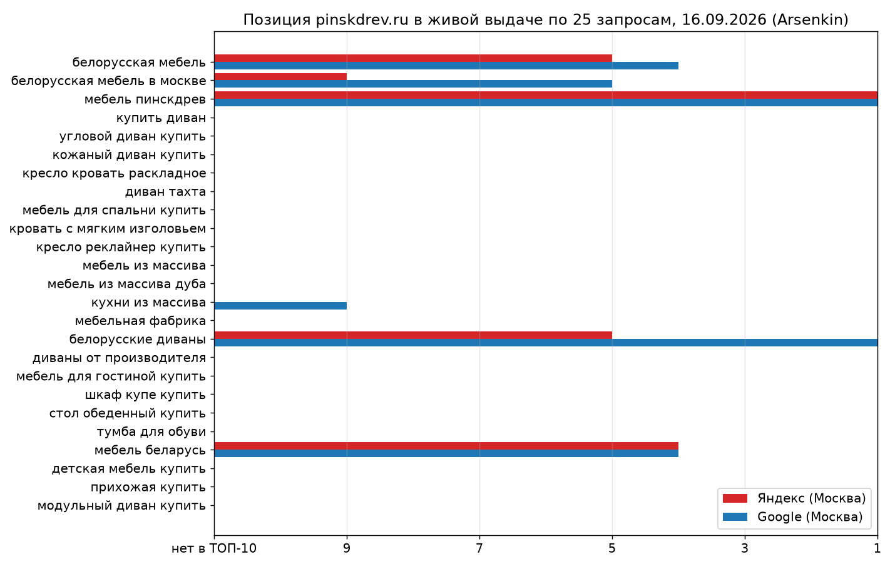

Кто занимает ТОП-10 Яндекса по этим запросам чаще всего: ozon.ru (10 запросов из 25), bestmebelshop.ru (9), divano.ru (6),
belshopmebel.ru (5), pinskdrev.ru (5), pushe.ru (5), msk.nonton.ru (5), minskmebel.ru (4), market.yandex.ru (4), hoff.ru (4).
В Google: pinskdrev.ru (10), divano.ru (9), belmebelshop.ru (7), good-mebel.com (7), pushe.ru (7), ozon.ru (6), stolplit.ru (6),
shatura.com (6).

Выдача делится на три слоя, и у каждого свои конкуренты.

### Таблица видимости в Яндексе (Keys.so, база Москва, 16.09.2026)

| Домен | Группа | ТОП-10 | ТОП-50 | Страниц | ИКС |
|---|---|:---:|:---:|:---:|:---:|
| **pinskdrev.ru (мы)** | | 2 934 | 10 840 | 1 632 | 2 460 |
| mebelpinskdreva.ru | дилер | 1 888 | 4 354 | 689 | 260 |
| pinskdrevmebel.ru | дилер | 2 340 | 7 215 | 1 462 | 490 |
| belfan.ru | белорусская фабрика | 6 849 | 28 640 | 2 144 | 990 |
| meb-elite.ru | белорусская мебель | 2 601 | 15 288 | 5 149 | 200 |
| drev-mebel.ru | массив, белорусские фабрики | 3 666 | 12 228 | 1 755 | 340 |
| mebeli-salon.ru | белорусская мебель | 3 384 | 11 001 | 1 613 | 320 |
| beldrevmebel.ru | белорусская мебель | 2 283 | 5 940 | 1 116 | 110 |
| minskmebel.ru | белорусская мебель | 1 738 | 5 749 | 1 256 | 150 |
| belmebel.ru | белорусская мебель | 1 804 | 5 508 | 1 373 | 490 |
| anrex-mebel.ru | фабрика Anrex | 1 255 | 2 638 | 530 | 440 |
| belshopmebel.ru | белорусская мебель | 907 | 1 963 | 393 | 210 |
| hoff.ru | федеральный ритейл | 374 200 | 990 439 | 52 383 | 10 600 |
| divan.ru | федеральный ритейл | 101 252 | 253 418 | 16 902 | 4 380 |
| bestmebelshop.ru | федеральный ритейл | 83 010 | 150 320 | 14 085 | 3 730 |
| divano.ru | федеральный ритейл | 29 215 | 109 121 | 10 357 | 1 070 |
| msk.nonton.ru | федеральный ритейл | 30 334 | 67 002 | 9 661 | 4 400 |
| pushe.ru | федеральный ритейл | 25 319 | 59 938 | 10 901 | 1 050 |

## 7. Дилеры и двойники бренда

### 7.1 mebelpinskdreva.ru. ТОП-10 1 888, из них брендовых 1 221

Дилер с title «Белорусская мебель Пинскдрев, официальный сайт в Москве и Московской области». По запросам «пинскдрев»,
«пинскдрев мебель», «пинскдрев каталог», «пинскдрев официальный сайт» стоит на 2-м месте, сразу за официальным сайтом.
Сумма точной частотности его брендовых запросов в ТОП-10 33 199 показов в месяц. На главной нет ни одной цены, 199 слов текста,
без H1, зато логотип «Пинскдрев. Мебель из Беларуси».

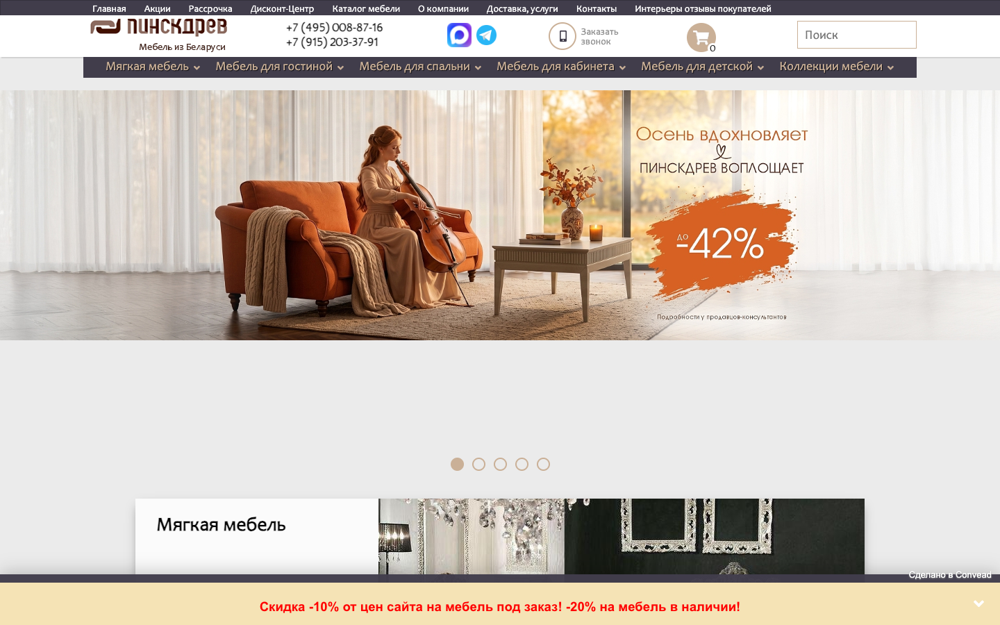

### 7.2 pinskdrevmebel.ru. ТОП-10 2 340, из них брендовых 584

Title «Белорусская мебель Пинскдрев - официальный сайт магазина мебели Белоруссии в Москве», федеральный номер 8 800 500-12-27,
описание в сниппете со звёздочкой и телефоном. 438 ссылающихся доменов, из них 17 с DR выше 30 (kommersant.ru, rosbalt.ru,
mk.ru), то есть по сильным донорам дилер обгоняет официальный сайт (12 таких доноров из 524).

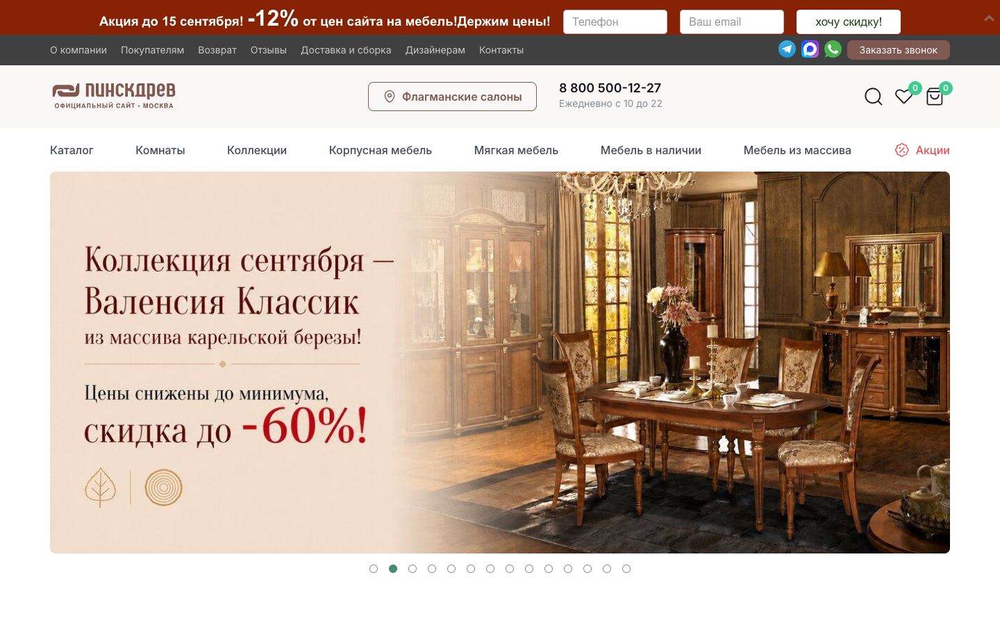

### 7.3 пинскдрев.рф и pinskdrev.by

пинскдрев.рф собирает 846 запросов в ТОП-50 и ведёт 1 533 объявления в Директе с 5 700 ключами, у него 980 общих ключей с нами.
pinskdrev.by, сайт фабрики в Беларуси, конкурирует в Google (1 070 общих запросов), hreflang между .by и .ru нет.

Итог по группе: брендовый спрос 40 626 показов в месяц по России делится минимум на четыре сайта, и все они называют себя
официальными. Ответ Алисы на запрос «пинскдрев или белфан что лучше» цитирует официальный сайт пятым, после rating.msk.ru,
otvet.mail.ru, belfan.ru и reviews.yandex.

## 8. Магазины белорусской мебели

### 8.1 belshopmebel.ru. ТОП-1 Яндекса по «белорусская мебель» при 393 страницах

Магазин мебели из массива. Первое место по главному запросу ниши при ИКС 210 и 393 страницах в выдаче. Причина в
структуре: главная это каталог по комнатам и материалам (мебель из дуба, из сосны, буфеты) с блоками оплаты, доставки и гарантии
на первом экране, без поп-апов.

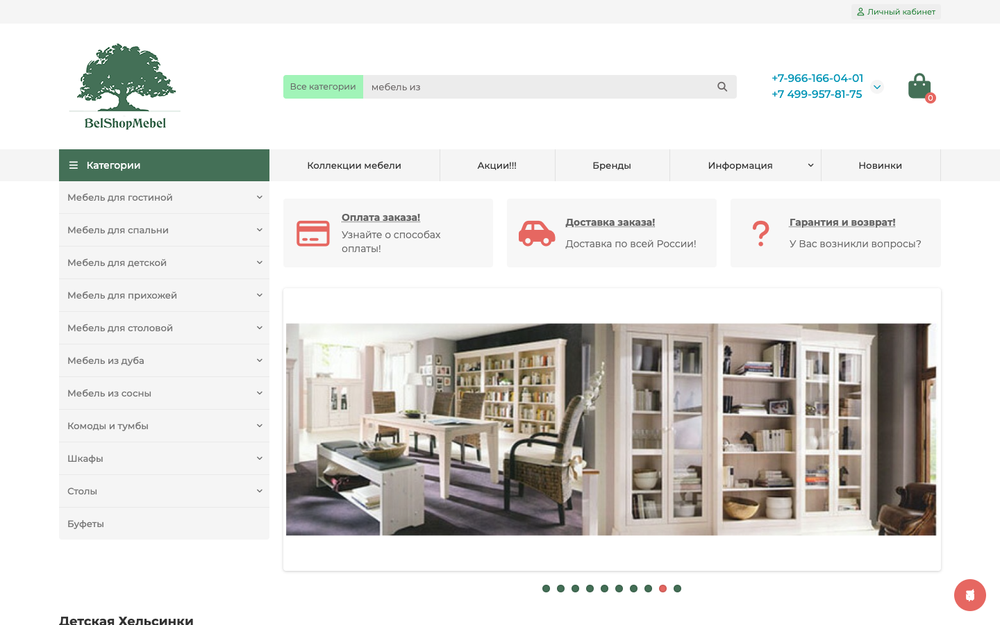

### 8.2 belmebel.ru и minskmebel.ru. Цены на главной

«Мебель Белорусская» показывает 22 цены на первом экране, minskmebel.ru 42 цены и обещание «гарантия выгодной цены». Оба в
ТОП-5 Яндекса по «белорусская мебель» и «мебель беларусь». У нас на главной цен нет: баннеры, поп-апы и «популярные категории».

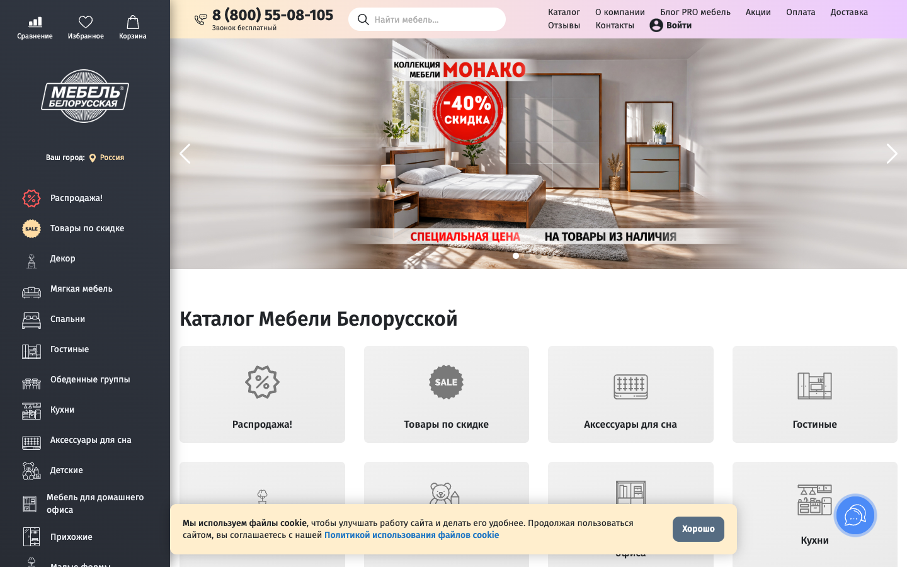

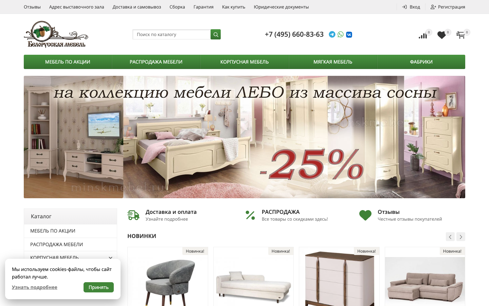

### 8.3 drev-mebel.ru и anrex-mebel.ru. Специализация

drev-mebel.ru занимает ТОП-1 по «мебель из массива» с позиционированием «мебель из массива дерева — наша специальность» и
1 911 ссылками с главной на категории. anrex-mebel.ru, сайт фабрики Anrex, на 3-м месте по «белорусская мебель» с восемью
городами на главной и разметкой JSON-LD.

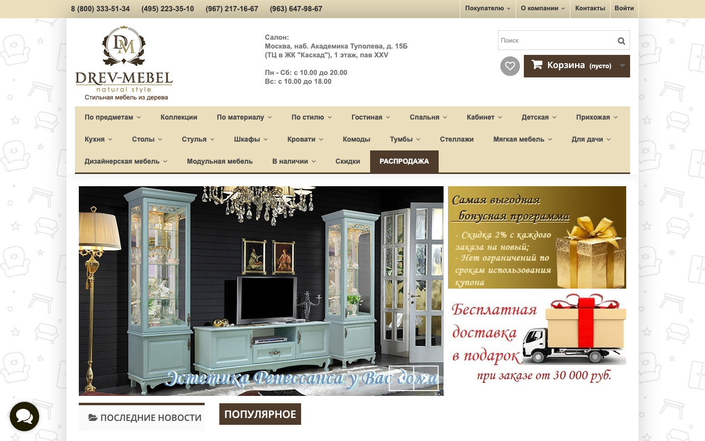

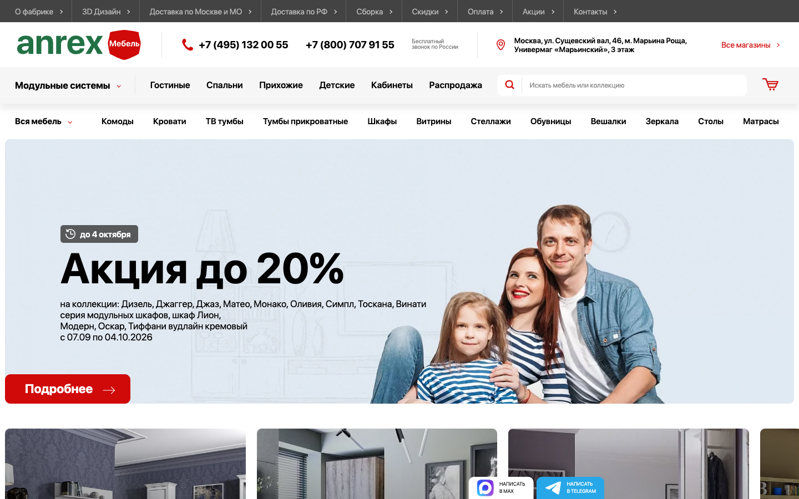

### 8.4 belfan.ru, meb-elite.ru, mebeli-salon.ru. Объём

belfan.ru (фабрика Белфан) держит 6 849 запросов в ТОП-10 и 28 640 в ТОП-50 при ИКС 990, это в 2,3 раза больше нашего ТОП-10
при ИКС в 2,5 раза меньше. meb-elite.ru и mebeli-salon.ru имеют 5 149 и 1 613 страниц в выдаче и 11–15 тысяч запросов в ТОП-50.
Все трое обгоняют нас за счёт числа посадочных под уточняющие запросы («белорусская мебель из массива», «белорусские кровати»,
«спальный гарнитур белорусский»).

## 9. Федеральные ритейлеры

По «купить диван», «угловой диван купить», «мебель для спальни купить» ТОП-10 занимают divano.ru, pushe.ru, bestmebelshop.ru,
hoff.ru, msk.nonton.ru, divan.ru, а также ozon и market.yandex. У них 5–50 тысяч страниц, отзывы и рейтинг в каждой карточке,
теговые страницы под каждый уточняющий запрос и ИКС 1 000–10 600. Здесь «белорусскость» не аргумент, выигрывают структура,
скорость и доверие.

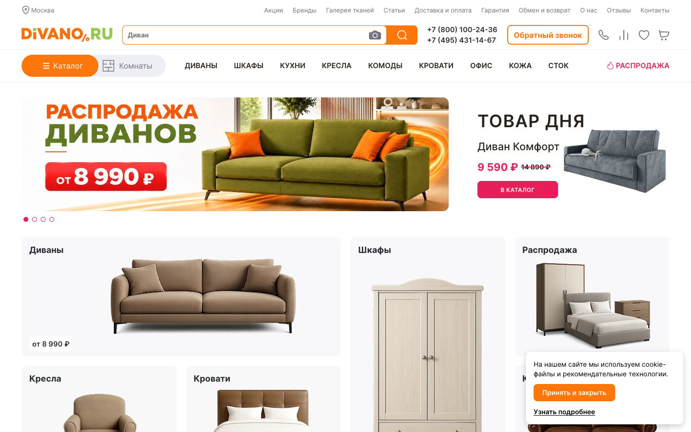

## 10. Разрыв по запросам, ссылки и ответы ИИ

**Разрыв.** Сравнение ТОП-10 десяти «белорусских» конкурентов с нашими позициями дало 22 997 запросов, по которым хотя бы один
конкурент в ТОП-10, а мы нет; по 21 247 из них нас нет и в ТОП-50. Чаще всего это уточнения «белорусская мебель» плюс тип
товара или город: белорусские кровати (7 конкурентов), белорусские столы (8), белорусская мебель из массива (6, 400 точных
показов), спальный гарнитур белорусский (6), стол обеденный из массива дерева купить (6, 174), белорусская мебель в омске,
новосибирске, липецке, туле, белгороде, ростове, екатеринбурге (по 6–7).

**Ссылки.** У pinskdrev.ru 524 ссылающихся домена, 12 из первой сотни с DR выше 30, анкоры естественные (безанкорные, адрес
сайта, названия коллекций). У дилера pinskdrevmebel.ru 438 доменов и 17 сильных доноров. Ссылочный профиль не ограничивает
рост, но и не помогает по конкурентным запросам.

**Ответы ИИ.** Keys.so фиксирует 548 AI-ответов Яндекса с упоминанием сайта. Прямая проверка Алисы по шести запросам: по
«белорусская мебель», «лучшие белорусские мебельные фабрики», «пинскдрев отзывы», «где купить белорусскую мебель в москве»
ответа Алисы нет; по «мебель из массива какую фабрику выбрать» сайт 15-й источник; по «пинскдрев или белфан что лучше» 5-й.

---

# Часть III. Сравнение и стратегия

## 11. Профиль pinskdrev.ru по единой методике

### Сильные стороны

- Авторитет: ИКС 2 460, DR 33–35, домен с 2005 года, 548 упоминаний в AI-ответах Яндекса, сеть из 328 магазинов.
- Готовый каталог: 2 869 карточек с ценой, наличием, рассрочкой, видео и характеристиками; 1 083 категорий и фильтровых
  страниц, которые уже собирают 3 012 запросов.
- Бренд: 913 брендовых фраз, 838 из них в ТОП-10; спрос на бренд 40 626 показов в месяц по России и растёт.
- В Google сайт уже в ТОП-10 по 10 из 25 запросов, база 9 085 запросов в ТОП-10.
- Региональные поддомены обгоняют основной домен в своих городах.
- Техника в основе исправна: коды ответов, редиректы, HTTPS, canonical, тексты категорий, отсутствие тонких страниц.

### Слабые стороны

- Видимость в Москве упала на 54 процента за 17 месяцев, первые места теряются.
- По общим категорийным запросам сайта нет в ТОП-10 Яндекса, 5 506 небрендовых запросов на 21–50 позициях.
- Брендовый спрос делится с дилерами, которые называют себя официальным сайтом; разметки Organization на главной нет.
- www отдаёт 500; карта сайта с 67 вложенными индексами и 91 битым адресом; 213 адресов в конфликте robots и sitemap.
- 214 страниц без H1, 431 без description, 1 220 длинных title, дубли title и H1 у фильтров, нет OG и JSON-LD в карточках.
- Нет отзывов и рейтинга в карточках, пустое itemprop description, 20 тысяч картинок без alt.
- Мобильная скорость 33–61, LCP 19–37 секунд в лаборатории, четыре поп-апа на первом экране.
- 300 тысяч дублирующих адресов на 60 слабых поддоменах, поддомены не связаны с основным доменом.

## 12. Сравнительная матрица

| Фактор | pinskdrev | mebelpinskdreva (дилер) | belshopmebel | belmebel | divano | hoff |
|---|:---:|:---:|:---:|:---:|:---:|:---:|
| ИКС | 2 460 | 260 | 210 | 490 | 1 070 | 10 600 |
| ТОП-10 Яндекс Москва | 2 934 | 1 888 | 907 | 1 804 | 29 215 | 374 200 |
| ТОП-10 по «белорусская мебель» (Я) | 5 | нет | 1 | 2 | нет | нет |
| ТОП-10 по «купить диван» (Я) | нет | нет | нет | нет | 1 | да |
| Цены на главной | нет | нет | нет | да | да | да |
| Отзывы и рейтинг в карточке | нет | нет | нет | частично | да | да |
| JSON-LD | только магазины | нет | нет | нет | да | да |
| Поп-апы при входе | 4 | 1 | 0 | 1 | 1 | 1 |
| Страниц в выдаче | 1 632 | 689 | 393 | 1 373 | 10 357 | 52 383 |
| Скорость mobile (PSI) | 33–61 | не замерялось | не замерялось | не замерялось | не замерялось | не замерялось |

Вывод по матрице. По силе домена pinskdrev.ru лидер своей ниши и проигрывает только федеральным гипермаркетам. Отставание
сосредоточено в трёх управляемых вещах: технические ошибки, отсутствие посадочных под уточняющий спрос и коммерческие сигналы в
карточках (отзывы, рейтинг, разметка). Это дешевле, чем догонять hoff по числу страниц.

## 13. Стратегия и точки роста

### Месяц 1. Техника и фундамент

1. www → 301 на основной домен. Проверить остальные 66 поддоменов на www-варианты.
2. Пересобрать sitemap.xml основного домена: только шесть своих карт, без 67 региональных индексов; у каждого поддомена свой
   индекс и своя подача в Вебмастере. Удалить 91 битый адрес, актуальный lastmod, автоматическая выгрузка при снятии товара.
3. Решить судьбу коллекций: открыть `/collections/` в robots и дать им текст и canonical на себя (это готовые посадочные под
   запросы по названиям моделей), либо убрать из карты. Убрать `/roomtypes`, `/styles`, `/site/` из карты, поправить Clean-param.
4. H1 на 176 новостей и 37 информационных страниц, description на 431 страницу (шаблон для новостей и блога), убрать вторые H1.
5. Новый шаблон title: карточки «Модель: купить за N руб. от производителя Пинскдрев», без артикула; единый шаблон категорий и
   фильтров; уникализация 30 групп дублей title и 28 групп H1 через добавление родительского раздела («Комоды для спальни»,
   «Комоды в гостиную»).
6. Пагинация: rel next/prev или self-canonical, title без «Москва(ру)», исправить битый canonical «Столы для дачи».
7. JSON-LD: Organization с sameAs, логотипом, телефоном и адресами на главной; Product с Offer, AggregateRating и Review в
   карточках; Store для 328 магазинов; Article в блоге; BreadcrumbList везде. Open Graph на все типы страниц.

### Месяцы 1–2. Бренд и дилеры

8. Закрепить статус официального сайта: Organization, Яндекс.Бизнес с подтверждением, брендовые сайтлинки, страница
   «Официальные дилеры» со списком партнёров (основа уже есть: страница «Доверяй, но проверяй» про подделки и «Преимущества
   официального представителя», их нужно переписать под задачу «где покупать»), единые правила для дилеров (не использовать
   «официальный сайт» в title, ссылка на фабрику). Это переговоры с партнёрами, а не только техника.
9. Отзывы: собрать отзывы в карточки (виджет, импорт из Яндекс.Бизнеса), вывести рейтинг в разметку. Отзывы же закроют запрос
   «пинскдрев отзывы», по которому сейчас первыми идут otzovik и rating.msk.ru.
10. Брендовые уточнения без посадочных («пинскдрев кухни каталог с ценами», «пинскдрев диваны», «пинскдрев магазины в москве»):
    проверить, что каждая ведёт на точную страницу, а не на главную.

### Месяцы 2–4. Структура под спрос

11. Вывести в полноценные разделы с текстом, фильтрами и перелинковкой: кресла-кровати (6 010 показов), тахты (9 022),
    реклайнеры (1 558, запрос потерян с 23-й позиции), стенки в гостиную (7 316 по России), угловые диваны (11 522), модульные
    диваны, кожаные диваны. Сейчас часть из них существует только как фильтр второго уровня с шаблонным title.
12. Посадочные под «белорусские» уточнения, которые забирают 6–8 конкурентов: «белорусская мебель из массива», «белорусские
    кровати», «белорусские столы», «белорусские спальни», «белорусские кухни». Это страницы-хабы с текстом, подборкой и ссылками
    на категории.
13. Кухни: вернуть «кухонный гарнитур» (29 325 показов, потеряна 16-я позиция) через отдельные посадочные по стилю и материалу
    и текст на `/catalog/kuhni/`.
14. Фильтровые страницы `/f/`: аудит всех 1 017, у каждой уникальный title, H1, description и 300–500 слов текста для ёмких
    фильтров; закрыть noindex комбинации без спроса.
15. Кластеризация 1 719 приоритетных фраз по ТОП-10 Яндекса и карта посадочных; далее мета-теги и тексты по кластерам.
    Информационное ядро (1 628 фраз) под блог с перелинковкой на категории; статьи «механизмы трансформации» уже ранжируются,
    их надо связать с каталогом.

### Месяцы 2–4. Регионы

16. Оставить семь сильных поддоменов (piter, krasnodar, novosibirsk, ekaterinburg, kazan, voronezh, saratov) и дать им
    региональный контент: адреса и фото магазинов, местная доставка и сборка, отзывы из города, региональные новости. Закрепить
    регион в Вебмастере, связать с основным доменом ссылками в обе стороны.
17. Остальные 60 поддоменов свести в основной домен: 301 на соответствующие адреса, а региональную задачу закрыть страницами
    магазинов `/shops/<город>/` с разметкой Store. Это уберёт около 270 тысяч дублей и сконцентрирует сигналы на pinskdrev.ru.
18. Для Москвы после склейки moscow: московские посадочные внутри основного домена (магазины Москвы, доставка по Москве,
    «белорусская мебель в москве» как хаб), потому что сама склейка Москву не подняла.

### Месяцы 3–6. Скорость, контент, ссылки, ИИ

19. Скорость: убрать 1,4 МБ неиспользуемого JS и 540 КБ CSS, отложить сторонние скрипты (Convead, чат, top.mail), сжать и
    отдать в WebP картинки первого экрана, исправить смешанный контент. Цель: mobile 70+, LCP до 2,5 секунд по CrUX.
20. Поп-апы: email-окно не раньше второй страницы, региональное окно компактной строкой, чат свёрнут на мобильном.
21. Alt для 20 тысяч картинок по шаблону «Модель, категория, цвет», это трафик из поиска по картинкам, где мебель ищут глазами.
22. Ссылки: PR-размещения в СМИ, где уже стоят дилеры (kommersant, mk, rosbalt), региональные медиа по городам магазинов,
    карточки на маркетплейсах со ссылкой на фабрику.
23. ИИ-видимость: страницы «как выбрать» с таблицами сравнения и цифрами (плотность, механизмы, гарантия), llms.txt, FAQ с
    разметкой. Сайт уже цитируется в 548 ответах Яндекса, задача попасть в ответы на «какую фабрику выбрать» и «отзывы».

### Измерение

24. Получить доступы: Яндекс.Вебмастер по всем 68 хостам и Search Console (Метрика уже открыта). Без них не видны реальные
    показы, клики, регионы и ошибки индексации 300 тысяч адресов. В Метрике: убрать utm-хвосты анти-бота или настроить их
    вырезание, починить цели «Заказать звонок» и «Связаться с менеджером», отфильтровать ботов из Китая и Финляндии.
25. Мониторинг позиций по 1 719 приоритетным фразам в Москве и по региональному ядру в семи городах, отчёт раз в две недели.
    Контрольные показатели: видимость Keys.so (сейчас 534), число небрендовых запросов в ТОП-10 (1 901), позиции по «купить
    диван», «спальня», «кресло кровать», «тахта», «белорусская мебель».

### Ожидание по эффекту

Небрендовый спрос ядра по Москве 271 032 точных показа в месяц, из них в ТОП-10 сейчас закрыто около четверти. Перевод даже
трети запросов из зоны 11–50 в ТОП-10 удваивает небрендовую видимость. По бренду цель конкретнее: вернуть первые места по всем
913 брендовым фразам и снять дилеров с 2–3 позиций, это 33 тысячи показов в месяц, которые сейчас уходят на чужие сайты.

## 14. Чему учиться у конкурентов

- **belshopmebel.ru.** ТОП-1 по «белорусская мебель» с 393 страницами: точные посадочные по материалу (дуб, сосна) и блоки
  доверия на первом экране без поп-апов.
- **belmebel.ru, minskmebel.ru.** Цены на главной и «гарантия выгодной цены»; главная как витрина, а не как баннер.
- **drev-mebel.ru.** Одна специализация в заголовке главной и 1 900 ссылок на категории с главной, ТОП-1 по «мебель из массива».
- **divano.ru, bestmebelshop.ru.** Отзывы и рейтинг в каждой карточке, теговые страницы под уточнения, разметка Product.
- **pinskdrevmebel.ru.** Как ни странно, у дилера: сниппет с телефоном и звёздочкой, 8-800 и 17 сильных доноров. Это то, что
  должен делать официальный сайт.

## 15. Что не проверено и что нужно от клиента

- Показы, клики, CTR, регион хоста и ошибки индексации из Яндекс.Вебмастера и Search Console: нет доступа. 17.09.2026
  клиент открыл Метрику, но Вебмастер к логину alkoseo не делегирован.
- Метрика: данные добавлены (раздел 2.4), но из-за utm-хвостов и сломанных целей отказы и конверсии по формам считать
  нельзя до исправления счётчика.
- Ahrefs (Google-ссылки и трафик): коннектор недоступен, Google-данные взяты из Keys.so.
- Обход поддоменов: проверен только piter (главная, четыре категории, статья, контакты, robots, две карты). Остальные 66 по
  картам и данным Keys.so.
- Карточки товаров: проверена случайная выборка 300 из 2 869.
- Логи сервера, реальный обход роботами: не доступны.
- Нужно от клиента: доступы к Вебмастеру (все хосты), Метрике, Search Console; список действующих дилеров и договорённости по
  использованию бренда; политику по региональным поддоменам (какие города важны бизнесу); данные о доле мобильных заказов.

## 16. Приложения

- [audits/2026-09-16-baza-nash-sayt.md](audits/2026-09-16-baza-nash-sayt.md), техническая база по сайту с таблицами проблем.
- [audits/2026-09-16-konkurenty.md](audits/2026-09-16-konkurenty.md), позиции по 25 запросам, три группы конкурентов, разрыв, ссылки.
- [audits/2026-09-16-semantika.md](audits/2026-09-16-semantika.md), ядро: источники, чистка, ёмкость направлений.
- `semantika/semantika-pinskdrev-POLNOE-YADRO.csv` (23 613 фраз), `semantika/semantika-pinskdrev-PRIORITET-msk.csv` (1 719 фраз).
- `snapshots/2026-09-16/`: robots.txt, sitemap-индекс, карты, результаты обхода 2 190 адресов, HTML ключевых страниц.
- `data/keysso/`, `data/arsenkin/`, `data/wordstat/`, `data/psi/`: сырые выгрузки.
- `screens/nash/`, `screens/konkurenty/`, `screens/grafiki/`: скриншоты и графики.
